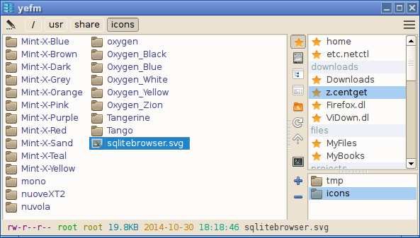
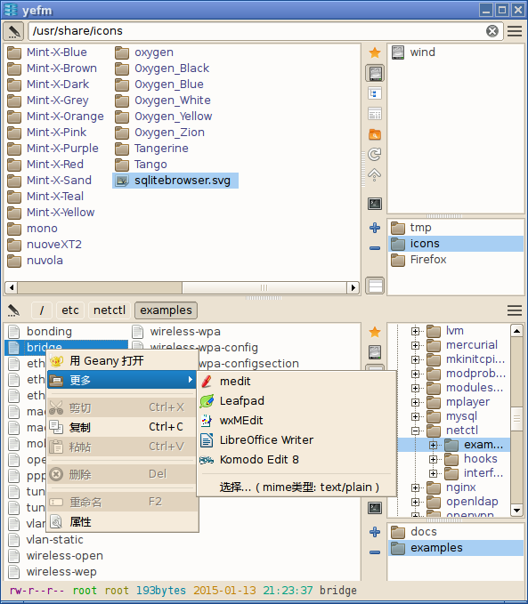
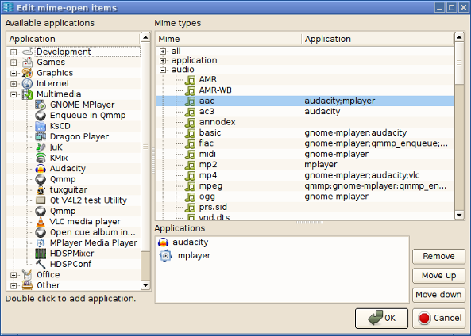

# Yefm - Simple 2 panes file manager based on Qt

##Features

- Simple GUI
- Multi-tabs
- 2 panes
- Colored status text
- With mime-open settings dialog
- Ability to drag folder or bookmark to add new tab
- Ability to drag a tab to another pane

##Depends

- qt{4/5}

